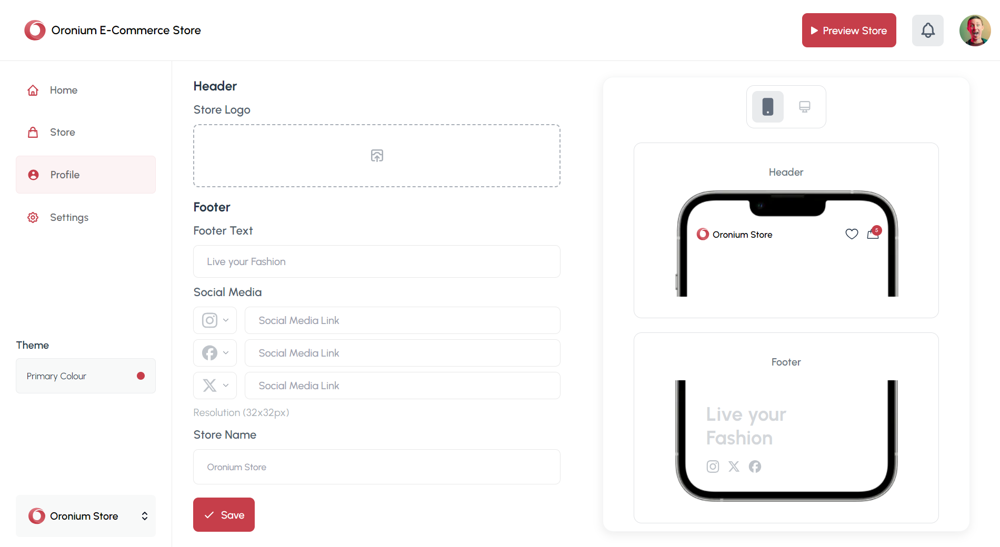

## Internship Task by Oronium - Oronium Store


## Fronted UI


Here's the Screenshot : 


You may access the hosted website using this link:
[Live Website](https://oronium-task-two.vercel.app)

To access the website locally, run the development server:

```bash
npm run dev
# or
yarn dev
# or
pnpm dev
# or
bun dev
```

Open [http://localhost:3000](http://localhost:3000) with your browser to see the main page.
And then head over to [/admin](http://localhost:3000/admin) page using the link provided in the main page to view the actual UI.

## Tech Stack Used :
<ul>
  <li>Next JS</li>
  <li>Tailwind CSS</li>
</ul>

## Features : 
Updating Soon
